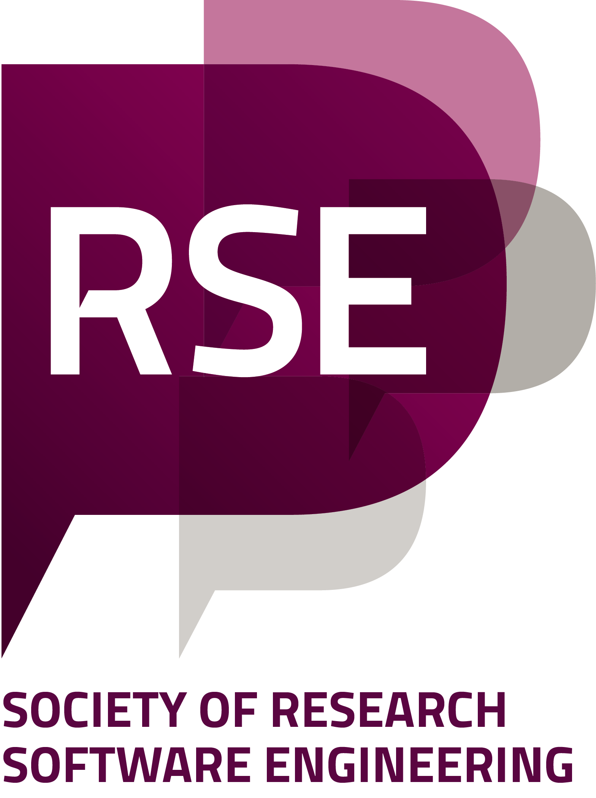
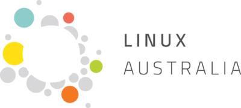
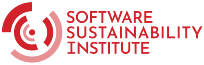
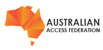
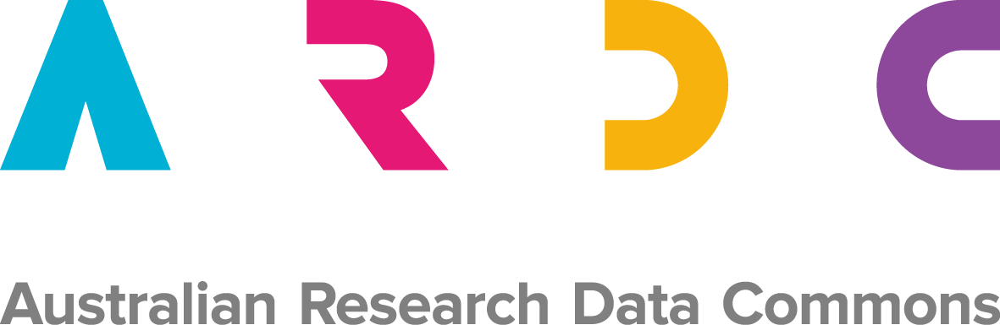

Do you want to learn what others are doing in research software in your domain and in other domains? Or do you want to discuss with others how you balance researcher needs with good software practices? Or maybe you are the only person working on research software in your group?

If so, you might want to join us for RSAA26, the fifth online annual Research Software Asia Australia Conference, from the **25th to the 28th of August 2026**. This is a joint partnership between the [RSE Asia Association](https://rse-asia.github.io/RSE_Asia/) and the [RSE Association of Australia and New Zealand](https://rse-aunz.github.io/). The theme for this year is **"Research Software Without Borders"** and the hashtag will be #RSAA26.

**RSAA26 has concluded.** The full conference page, including the Accessibility Fellowship Reports, is at [RSEAA26](/RSEAA26).

## Partners

   

   

We would like to thank our Asia Spotlight Partner [ACCESS-NRI](https://www.access-nri.org.au/) for supporting us, as well as our Accessibility Partners the [Society of RSE](https://society-rse.org/), [Linux Australia](https://linux.org.au/), and the [Software Sustainabilty Institute](https://www.software.ac.uk/). We would also like to thank our Trust and Identity Partner [Australian Access Federation (AAF)](https://aaf.edu.au/), and our Supporting Partner [ARDC](https://ardc.edu.au/) for their contribution to our conference.

## Introducing Research Software Africa, Research Software Latinoamérica, and Equersa

We are thrilled to announce that we are helping to setup two new conferences Research Software Africa (RSA26) and Research Software Latinoamérica (RSLA26)!

We are creating one joint organising committee, while co-chairs for each conference still get to choose what happens at their event.

As part of this one joint committee, [we have created Equersa](https://rseaa.org/equersa/), an umbrella organisation to help coordinate the conferences and to provide a unified front to global funders and stakeholders.

More on RSA26, RSLA26, and Equersa soon!

## Accessibility Fellow Reports

<a class="rse rse-join" href="https://rseaa.org/accessibility-fellow/reports/2026/an-thu-nguyen">Accessibility Fellow Report - An Thu Nguyen</a>

<a class="rse rse-join" href="https://rseaa.org/accessibility-fellow/reports/2026/asmaa-rashad">Accessibility Fellow Report - Asmaa Rashad</a>

<a class="rse rse-join" href="https://rseaa.org/accessibility-fellow/reports/2026/carlos-olivera">Accessibility Fellow Report - Carlos Andres Olivera Caballero</a>

<a class="rse rse-join" href="https://rseaa.org/accessibility-fellow/reports/2026/aishwarya-tulsi-vijay">Accessibility Fellow Report - Aishwarya Tulsi Vijay</a>

<a class="rse rse-join" href="https://rseaa.org/accessibility-fellow/reports">All Accessibility Fellowship Reports</a>

## Why would someone go to RSAA26?

Some of the other motivations for attending might include:

- To talk about difficulties in career progression and lack of recognition with others who work on research software
- To share the interesting work you have done in research software
- To learn from others how to make their research software more visible
- To learn about how others create applications for researchers
- To learn about how others streamline and scale their research workflows
- To discuss with others how they balance researcher needs with good software practices
- To discuss with others how they make their research software easier to use

## Important Dates (2026):

| Event                                                         | Opens on   | Closes on      | Notification of Result of Application |
| ------------------------------------------------------------- | ---------- | -------------- | ------------------------------------- |
| Call for Proposal                                             | 20th March | 29th May       | 7th July                              |
| Call for Accessibility Fellowship                             | 21st May   | 26th June      | TBA                                   |
| Call for Micro-grants                                         | 21st May   | 10th July      | Communicated on a rolling basis       |
| Call for Scholarships                                         | 21st May   | 14th August    | Communicated on a rolling basis       |
| Call for Volunteer (Reviewer, Session Chair)                  | 20th March | Not Applicable | Communicated on a rolling basis       |
| Event Registration (Early Bird, Scholarship, and Micro-grant) | 15th June  | 10th July      | Not Applicable                        |
| Event Registration (Standard)                                 | 11th July  | 14th August    | Not Applicable                        |

## Want to sign up for updates?

- [Click here to sign up for the RSAA mailing list](https://forms.gle/6YdKBMNX19vniVmk8)
- [Click here to follow us on LinkedIn](https://www.linkedin.com/company/rseaa/)
- [Click here to follow us on Mastodon](https://fediverse.au/@RSEAA)

## Call for Presentations

The Call for Presentations (CFP) for RSAA26 closed on 29th May. The program that resulted from it is on the [RSAA26 Program](/rsaa26_program) page.

### Author Guidelines

The author guidelines that applied to RSAA26 are in the [RSAA26 Author Guidelines](rsaa26_author_guidelines) document.

## Call for Workshops

The Call for Workshops for RSAA26 has closed. The workshops that were delivered are listed on the [RSAA26 Program](/rsaa26_program) page.

## Accessibility and Inclusivity

We were committed to creating a safe, accessible, and inclusive environment for all participants.

In 2022, [Liz Hare](https://twitter.com/DogGeneticsLLC) provided a [high-level accessibility report for the conference](RSEAUNZAccessibility.html) that we use as a benchmark for our performance.

RSAA26 offered scholarships for staff or students to participate for free, as well as 10 accessibility micro-grants valued at $50 AUD to help with internet, headphones, childcare etc.

Eligibility for the scholarships was based on prioritising and maximising the inclusion and participation of people who have been impacted due to the cumulative effects of discrimination on factors such as race, gender, disability, gender identity, financial status, and the intersectionality of that discrimination, as well as others not mentioned here.

Eligibility for the accessibility micro-grants was based on a similar approach.

If you have feedback about how well the conference met these commitments, please let us know by contacting the committee at info at rseaa.org.

The RSAA26 Accessibility Fellowship brought individuals with disabilities - such as those who are deaf, hard of hearing, blind, have low vision, or have other disabilities - into the conference from our community and adjacent communities, so that we could be held accountable for the accessibility of the event. You can read the fellows' reports in the [Accessibility Fellow Reports](https://rseaa.org/accessibility-fellow/reports) section above.

## Organising Committee Members

- Jyoti Bhogal
- Junran Lei
- Linda Erlina
- Keiran Rowell
- Sanchit Ghule
- Harsh Kalra
- Rowland Mosbergen
- Sandeep Kanabar
- Peiyu Wu
- Yifei Wang
- Deepika Kashyap
- Trish Radotic
- Saranjeet Kaur
- Amna Deakin
- Gregory Poole
- Seaumul Islam
- Pao Corrales
- Tyrone Chen
- Xiaoya (YaYa)
- Leon Nunes
- Tasfia Trahman
- Rania Aziz
- Xiangdi (Allie) Hu

## Code of Conduct

[The Code of Conduct](https://rse-aunz.github.io/code-of-conduct) is designed to provide all participants with community participation guidelines.

## What is a Research Software Engineer (RSE)?

Research Software Engineer is a broad term for people who combine programming and research skills that have trouble defining their role and value within academia. e.g

- researchers and academics who code,
- generalists who bring communities together across the research and technical domains,
- people who help train researchers to improve their code on HPC and Cloud systems, and
- software engineers who work in the research domain.

## Contact Us

If you would like to know more or have any questions, please contact the organising committee at info@rseaa.org by email.

## Marketing materials

[Our marketing materials for RSAA26 are here](/marketing).

## Previous RSEAA conferences

- [Click here to view the 2026 conference](/RSEAA26).
- [Click here to view the 2025 conference](/RSEAA25).
- [Click here to view the 2024 conference](/RSEAA24).
- [Click here to view the 2023 conference](/RSEAA23).
- [Click here to view the 2022 conference](/RSEAA22).

*The <a href="https://cmt3.research.microsoft.com">Microsoft CMT service</a> was used for managing the peer-reviewing process for this conference. This service was provided for free by Microsoft and they bore all expenses, including costs for Azure cloud services as well as for software development and support.*

